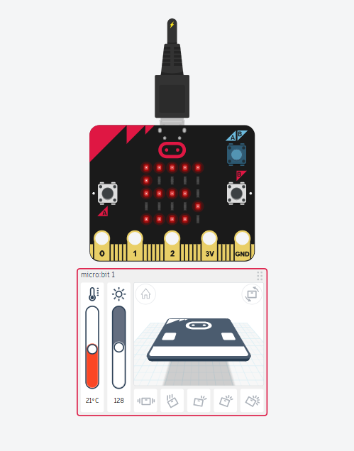

# Prime Number Checker using micro:bit

## 📌 Project Overview
This project checks whether a given number is **prime** using a micro:bit.  
The user sets a number using the buttons, and the micro:bit checks divisibility up to the square root of the number using the formula **isPrime = (num % i ≠ 0 for all i from 2 to √num)**.

---

## 🎯 Objectives
- To understand the concept of prime numbers
- To apply divisibility checks using a loop
- To use event-driven programming with micro:bit
- To simulate a prime number checker using Tinkercad

---

## 🧩 Components Used
- micro:bit (simulated)
- Button A
- Button B
- 5×5 LED display

---

## 🛠️ Tools & Technologies
- Tinkercad Circuits
- micro:bit
- MakeCode Blocks
- GitHub

---

## ⚙️ Working Principle
- **On Start**: Sets the default number (`num`) to **5** and displays it on the LED screen
- **Button A (Pressed)**: Runs the prime check algorithm on the current number
  - Loops from `i = 2` while `i × i ≤ num`
  - If `num % i = 0`, marks it as **not prime** and shows the divisor
  - After the loop, if `isPrime = 1`, displays **"prime Number"**
- The LED display shows the number, any divisor found, or the "prime Number" message

---

## 🧮 Mathematical Concepts Used
- Prime numbers: A number greater than 1 with no divisors other than 1 and itself
- Divisibility: `num % i = 0` means `i` divides `num` evenly
- Loop optimization: Only check divisors up to √num (i.e., `i × i ≤ num`)
- Boolean flag: `isPrime` is set to 0 if a divisor is found

---

## 🖼️ Circuit Design (Screenshot)

---

## How to Build the Project Using Blocks (Step-by-Step)

### Step 1: Refer to the above diagram
Refer to the circuit diagram to see the micro:bit placed in the Tinkercad workspace.  
No extra components or wires are needed because the micro:bit already has built-in buttons and an LED display.

---

### Step 2: Open Tinkercad and add micro:bit
1. Open the Tinkercad website: (https://www.tinkercad.com/)
2. Click on **Circuits**.
3. Click **Create New Circuit**.
4. From the components list, drag a **micro:bit** into the workspace.

---

### Step 3: Open the Code section and choose Blocks
1. Click on the **Code** button.
2. Select **Blocks** as the coding option.
3. You will see colorful coding blocks on the screen.

---

### Step 4: Create variables
1. Click on the **Variables** section.
2. Create the following variables:
   - `num` (the number to check)
   - `i` (loop counter for divisibility check)
   - `isPrime` (flag: 1 = prime, 0 = not prime)

These variables help the micro:bit track the number being tested and the result.

---

### Step 5: Set starting values (On Start block)
1. Drag the **on start** block.
2. Set:
   - `num` to **5**
3. Add a **show number** block with `num`.

This displays the default number when the micro:bit starts.

---

### Step 6: Program Button A (Run Prime Check)
1. Drag the **on button A pressed** block.
2. Inside it, add the following logic:
   - Set `i` to **2**
   - Set `isPrime` to **1**
   - Add a **repeat while** block with condition: `i × i ≤ num`
     - **If** `num % i = 0` **then**:
       - **show number** `i` (the divisor)
       - **show number** `num / i` (the quotient)
       - Set `isPrime` to **0**
     - Set `i` to `i + 1`
   - After the loop, **if** `isPrime = 1` **then**:
     - **show string** `"prime Number"`

This runs the full prime check and displays the result on the LED display.

---

### Step 7: Understand the calculation
The prime check works as follows:
- Start with `i = 2` and `isPrime = 1` (assume prime)
- Loop while `i × i ≤ num` (only check up to √num for efficiency)
- If any `i` divides `num` evenly (`num % i = 0`), set `isPrime = 0` and show the factor
- After the loop, if `isPrime` is still 1, the number is prime — display **"prime Number"**

**Example:** For `num = 5`:
- i=2: 5 % 2 ≠ 0 → continue
- i=3: 3×3=9 > 5 → loop ends
- `isPrime = 1` → display **"prime Number"** ✅

**Example:** For `num = 6`:
- i=2: 6 % 2 = 0 → show 2 and 3, set isPrime = 0
- Loop ends
- `isPrime = 0` → no "prime Number" message ❌

---

### Step 8: Start the simulation
1. Click **Start Simulation**.
2. Observe the number displayed on the LED screen (default: 5).
3. Press **Button A** to run the prime check.
4. Watch the result appear:
   - If prime: the display scrolls **"prime Number"**
   - If not prime: the display shows the first divisor found and the quotient

---

## 🖼️ Simulate: Variable Manipulator (Create Your Own)
Create your own number checker in Tinkercad:
1. Use the same micro:bit setup (no extra components).
2. Add Button B to increase or decrease `num` before pressing Button A.
3. Modify the formula to explore other number properties (e.g., even/odd, perfect numbers).
4. Display custom messages for special cases (e.g., num = 1 → show "Not Prime", num = 2 → show "prime Number").

---
